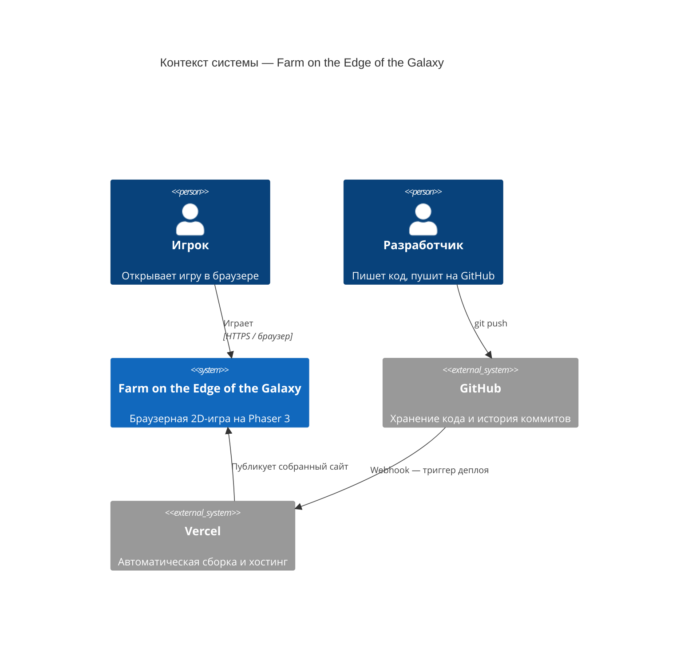
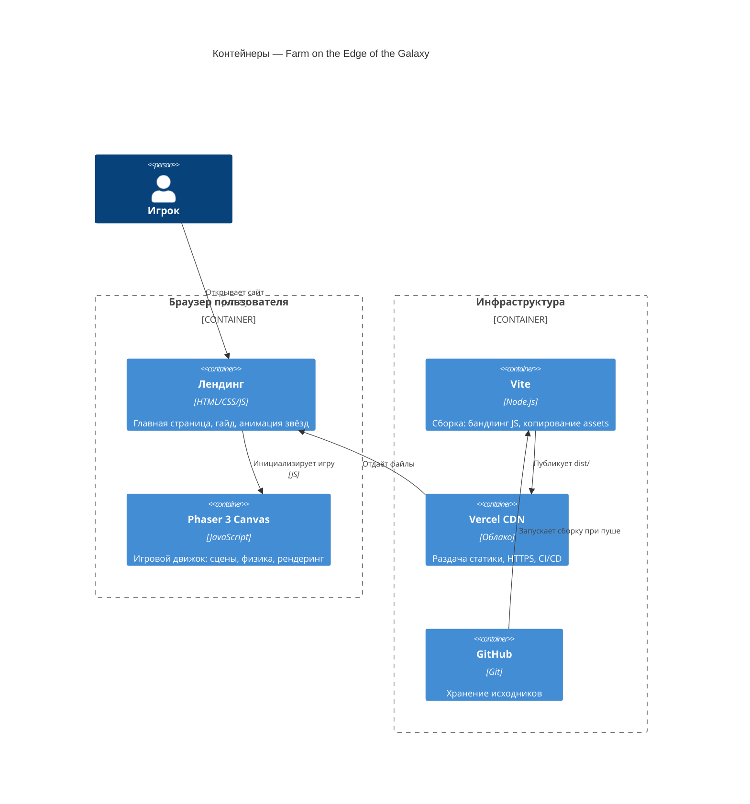
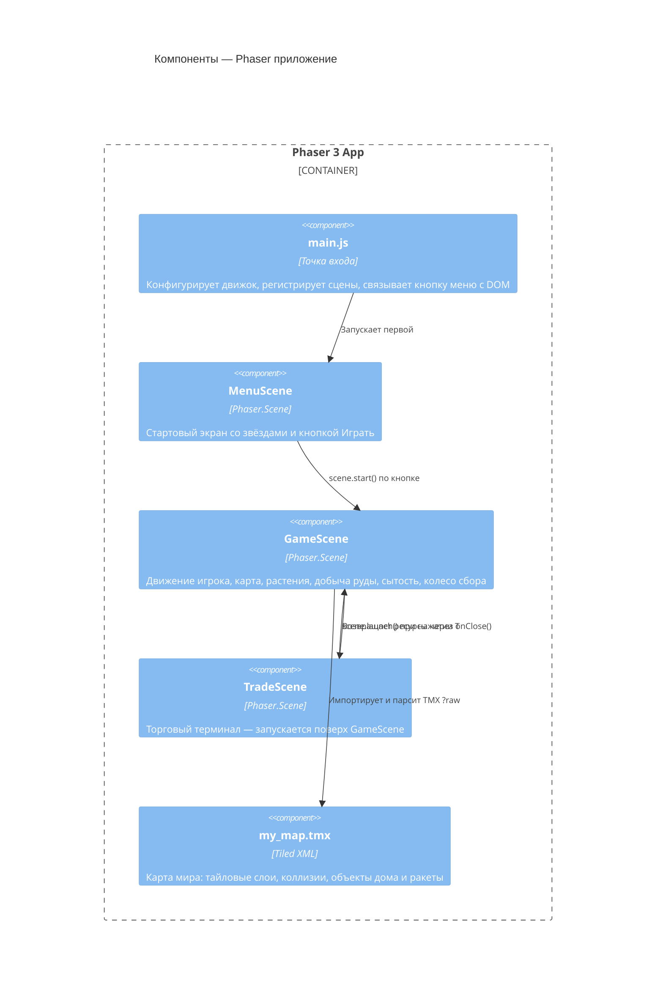

# 🌌 Farm on the Edge of the Galaxy

> Браузерная 2D-игра об основах микроэкономики: производство, потребление и торговля на другой планете.

[](https://farm-on-the-edge-of-the-galaxy.vercel.app)
[](https://github.com/arturik2288/Farm-on-the-edge-of-the-galaxy)

---

## Для пользователей

### О чём игра

Вы — фермер на далёкой планете. Чтобы выжить, нужно добывать ресурсы, следить за сытостью и торговать на межзвёздном рынке. В игре два вида производства и два вида потребления — ровно как в базовой модели микроэкономики.

### Как начать

1. Откройте сайт по ссылке выше
2. Нажмите **Играть** на главном экране
3. Используйте клавиши для управления

### Управление

| Клавиша | Действие |
|---|---|
| `← →` | Двигаться влево / вправо |
| `Space` или `↑` | Прыжок |
| `↑ ↓` у лестницы | Подняться / спуститься |
| `E` (удержать) | Собрать растение или добыть руду |
| `Q` у дома | Поесть (нужно: 1 еда + 1 вода) |
| `T` у ракеты | Открыть торговый терминал |
| `Esc` | Закрыть терминал |

### Ресурсы

| Ресурс | Как получить |
|---|---|
| 🌿 Растения | Собирать на грядках через колесо сбора |
| ⛏ Руда | Добывать под землёй через колесо сбора |
| 🍖 Еда | Обменивать в терминале |
| 💧 Вода | Обменивать в терминале |

### Колесо сбора

При нажатии `E` запускается вращающаяся стрелка. Отпустите `E` когда стрелка попадёт в нужную зону:

- 🟢 **Зелёная зона** — +2 ресурса
- 🟡 **Жёлтая зона** — +1 ресурс
- 🔴 **Красная зона** — ничего

### Торговый терминал

Откройте терминал клавишей `T` рядом с ракетой. Доступны два окна:

- **Официальный терминал** — стабильные цены, простые обмены
- **Чёрный рынок** — цены ниже, но каждая повторная сделка дорожает. Выгоднее строить **цепочки**: Растения → Руда → Еда обходится дешевле, чем Растения → Еда напрямую

Цены сбрасываются каждые **3 минуты** — следите за таймером.

### Аналоги

| Игра | Описание |
|---|---|
| [RimWorld](https://rimworldgame.com/) | Sci-fi симулятор колонии с экономикой и выживанием |
| [Stardew Valley](https://www.stardewvalley.net/) | Фермерский симулятор с торговлей и развитием |
| [Space Haven](https://en.wikipedia.org/wiki/Space_Haven) | Космический симулятор колонии |
| [Factorio](https://www.factorio.com/) | Симулятор производственных цепочек |

---

## Для разработчиков

### Стек

| Технология | Роль |
|---|---|
| [Phaser 3](https://phaser.io/) | Игровой движок: физика, сцены, рендеринг |
| [Vite](https://vitejs.dev/) | Сборщик и dev-сервер |
| [Tiled](https://www.mapeditor.org/) | Редактор карты (TMX формат) |
| [Vercel](https://vercel.com/) | Хостинг и CI/CD |
| Vanilla JS | Без фреймворков поверх Phaser |

### Быстрый старт

```bash
# Клонировать репозиторий
git clone https://github.com/arturik2288/Farm-on-the-edge-of-the-galaxy.git
cd Farm-on-the-edge-of-the-galaxy

# Установить зависимости
npm install

# Запустить dev-сервер
npm run dev

# Собрать продакшн-билд
npm run build
```

### Структура проекта

```
├── index.html              # Лендинг + точка входа Vite
├── src/
│   ├── main.js             # Конфиг Phaser, регистрация сцен
│   ├── style.css           # Стили лендинга
│   └── scenes/
│       ├── GameScene.js    # Основная игровая логика
│       ├── TradeScene.js   # Торговый терминал (оверлей)
│       └── MenuScene.js    # Главное меню
├── public/
│   └── assets/
│       ├── sprites/        # Спрайт игрока
│       ├── tilesets/       # Тайлсет карты
│       └── objects/        # Дом, ракета
└── tiled/
    ├── my_map.tmx          # Карта в формате Tiled XML
    ├── zp.tsx              # Описание тайлсета
    └── im.tsx
```

---

### Архитектура (C4)

#### Уровень 1 — Контекст системы



#### Уровень 2 — Контейнеры



#### Уровень 3 — Компоненты (Phaser)



---

### Ключевые решения

**Парсинг карты без плагина**
Карта загружается через `import map from '...tmx?raw'` (Vite) и парсится встроенным браузерным `DOMParser`. Это позволяет избежать зависимости от плагина Phaser TMX Loader и держать карту как обычный XML-файл в репозитории.

**Общее колесо сбора для растений и руды**
Вместо двух отдельных реализаций используется единый набор переменных `harvestState / harvestAngle / harvestSpeed`. Переменная `harvestMode` (`'plant'` | `'ore'`) служит дискриминатором — позволяет корректно отменять добычу при выходе из шахты, не затрагивая механику сбора растений.

**Сцены как оверлеи**
`TradeScene` не останавливает `GameScene`, а запускается поверх неё через `scene.launch()`. Это даёт fade-эффект с видимым фоном игры. Данные передаются явно через `init(data)` при открытии и через коллбэк `onClose()` при закрытии.

**Прогрессивные цены**
Каждая сделка увеличивает цену на 1: `currentCost = baseCost + tradeCounts[id]`. Через 3 минуты счётчики сбрасываются. Это делает арбитраж через чёрный рынок временно выгодным, пока цены не выросли.

### Деплой

Репозиторий подключён к Vercel. Любой `git push` в ветку `main` автоматически запускает `npm run build` и публикует результат. Папка `dist/` в репозиторий не коммитится (прописана в `.gitignore`).

---

> Проект разработан в учебных целях. Использование генеративного ИИ задокументировано отдельно.
